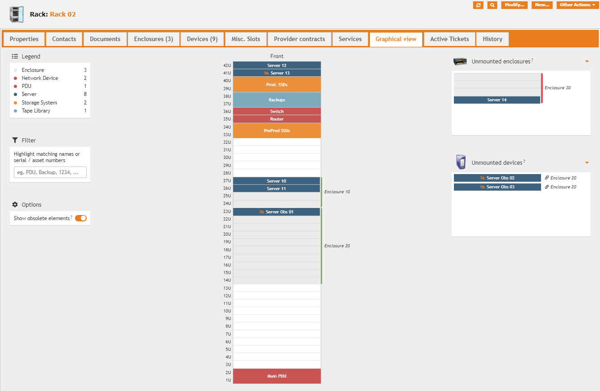
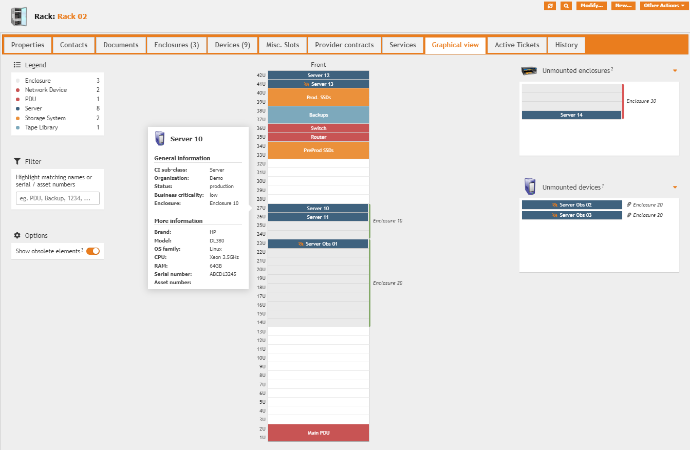
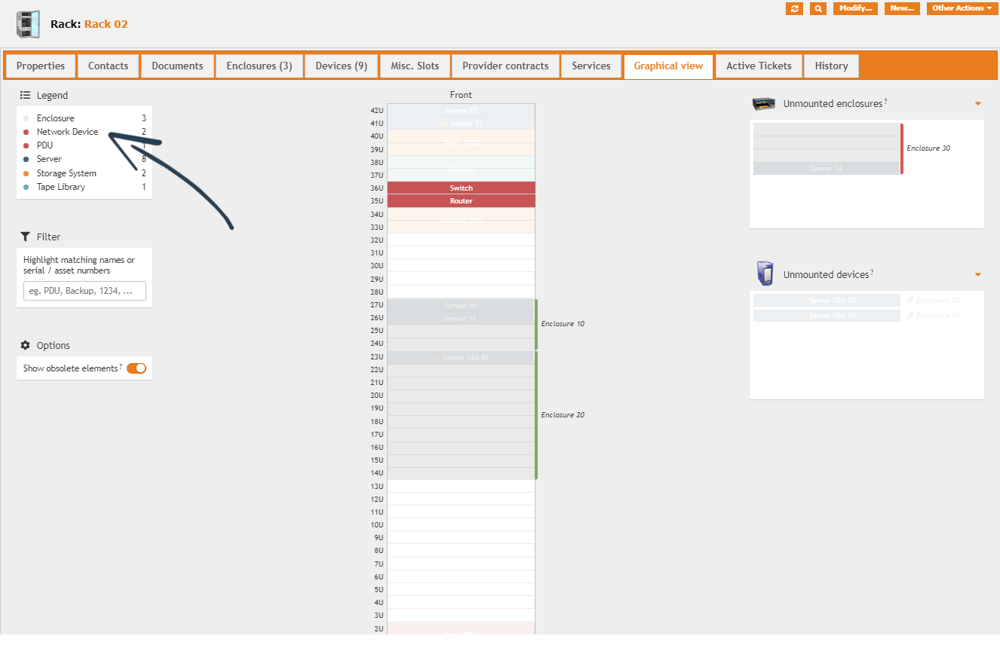
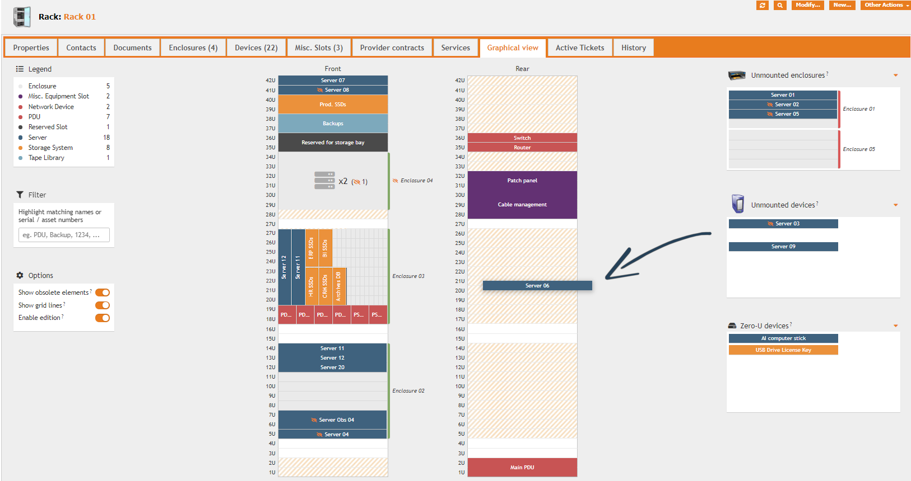
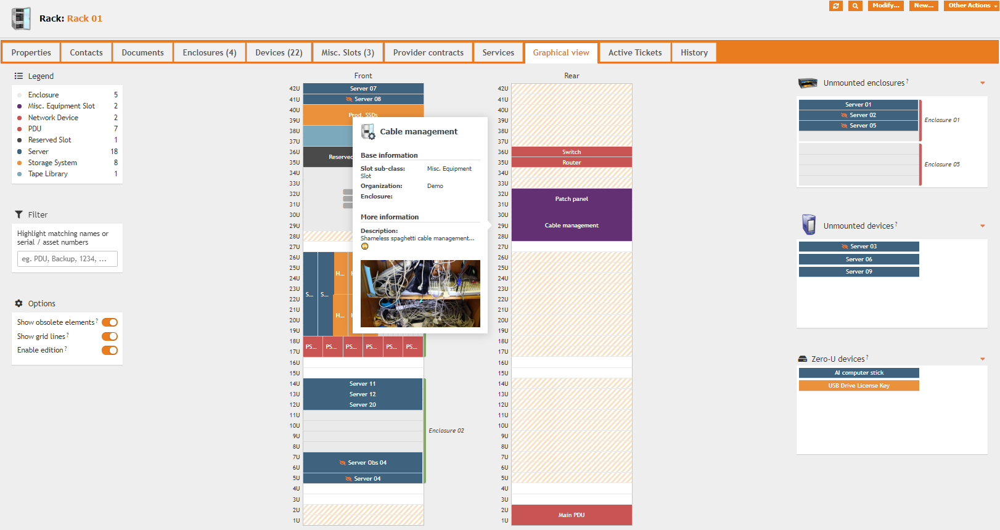
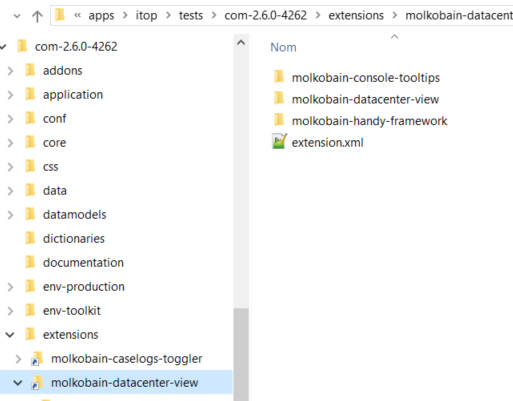
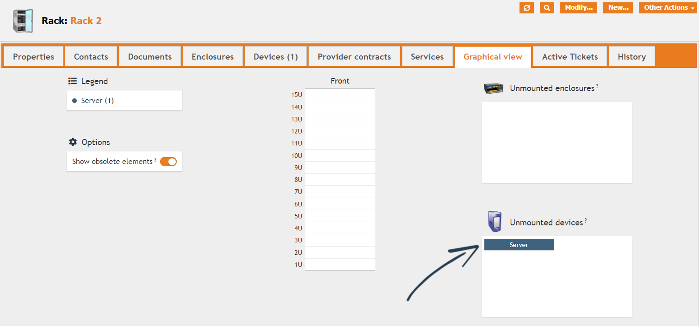
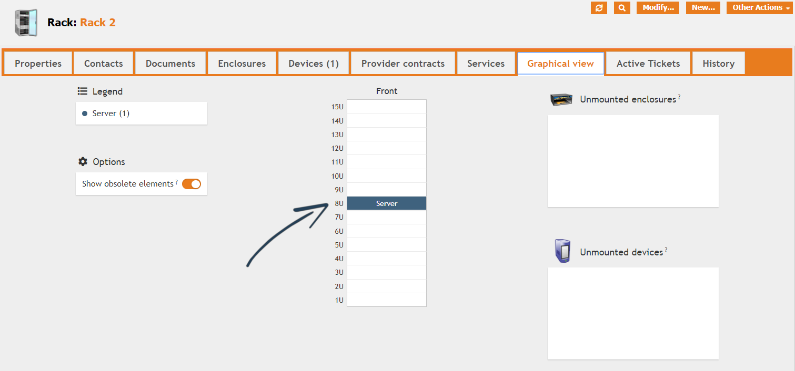

👋 [Available on Molkobain I/O](https://www.molkobain.com/product/datacenter-view/)

# iTop extension: molkobain-datacenter-view
* [Description](#description)
* [Advanced features](#advanced-features-in-the-paid-version-)
* [Online demo](#online-demo)
* [Compatibility](#compatibility)
* [Downloads](#downloads)
* [Installation](#installation)
* [Configuration](#configuration)
* [How to](#how-to)

## Description
Easily manage & visualize your racks, enclosures and datacenter devices.
* See at a glace where your devices are.
* Check which attached devices have no position set.
* Toggle obsolete devices easily.
* Full support of english, french & dutch languages.



Access device's main information on hover (customizable)


Identify specific devices type by hovering the legend



### Advanced features in the paid version 🚀
* [Drag & Drop](drag--drop)
* [Rear panel support](rear-panel-support)
* [Consistency checks](consistency-checks)
* [Audit rules](audit-rules)
* [Reserved slots](reserved-slots)
* [Custom classes]()
* [Misc. options](misc-options)

#### Drag & Drop
Drag & drop elements in the graphical view to easily set their position instead of manually editing each elements!


#### Rear panel support
* Available in both racks and enclosures
* Automatically shows occupancy on the opposite panel


####Consistency checks
Optional consistency checks are made on elements during creation / update:
* Overlapping elements
* Malpositioned elements (outside rack's / enclosure's grid)
* Total elements' height exceeds rack's / enclosure's capacity


####Audit rules
Comes with a bunch of audit rules to keep your datacenter vision clear:
* Production elements should have position set when attached to a rack or enclosure
* Positioned elements should be attached to a rack or enclosure
* Positioned elements should have *Rack units* attribute set
* Positioned elements should not overlap another one
* Positioned elements should not be outside its rack's or enclosure's (exceed height or malpositioned)


####Reserved slots
Two new object classes to better describe your racks and enclosures:
* ReservedSlot: Reserve space in a rack / enclosure for any future usage or element.
* MiscEquipmentSlot: Mark space as used for patch panel or cable management for example.



####Misc. options
* Us order: Reserve Us order per rack / enclosure to fit your set-up
* Enclosure layout: Either display enclosure's elements or just the number of elements in it

## Online demo
You can try this extension on the online demo. There are already some racks, enclosures and devices mounted as an example. Just click on the links below to access it:
* [Administration console](http://mbc.itop.molkobain.com/pages/UI.php?operation=details&class=Rack&id=15&c[menu]=SearchCIs&auth_user=admin&auth_pwd=admin#tabbedContent_0=7) (admin / admin)

## Compatibility
Compatible with iTop 2.4+

## Dependencies
* Module `molkobain-handy-framework/1.2.3`
* Module `molkobain-console-tooltips/1.0.2`

*Note: All dependencies are included in the `dist/` folder, so all you need to do is follow the installation section below.*

## Downloads
Stable releases can be found either on the [releases page](https://github.com/Molkobain/itop-datacenter-view/releases) or on [Molkobain I/O](https://www.molkobain.com/product/datacenter-view/).

Downloading it directly from the *Clone or download* will get you the version under development which might be unstable.

## Installation
* Unzip the extension
* Copy the ``molkobain-datacenter-view`` folder under ``<PATH_TO_ITOP>/extensions`` folder of your iTop
* Run iTop setup & select extension *Datacenter view*

*Your folders should look like this*



## Configuration
No configuration needed, the extension can be used out of the box!

### Parameters
Some configuration parameters are available from the Configuration editor of the console:
* `enabled` Enable / disable the extension without having to uninstall it. Value can be `true` or `false`.
* `device_tooltip_attributes` Specify which attributes to display in the devices tooltip on hover. Must be an array of object classes pointing to an array of attributes (see example below).

*Default values:*
```
'enabled' => true,
'device_tooltip_attributes' => array(
    'DatacenterDevice' => array(
        'brand_id',
        'model_id',
        'serialnumber',
        'asset_number',
    ),
    'NetworkDevice' => array(
        'networkdevicetype_id',
        'brand_id',
        'model_id',
        'ram',
        'serialnumber',
        'asset_number',
    ),
    'Server' => array(
        'brand_id',
        'model_id',
        'osfamily_id',
        'cpu',
        'ram',
        'serialnumber',
        'asset_number',
    ),
),
```

## How to
### Position a device on a rack
A quick example to show how to manually position a device on a rack.

In this example, the *Rack 2* has a *Server* attached but is listed among the *unmounted* devices. This is because the *server* has no *position* set.


To fix this, edit the *server* and make sure it has both *position* and *rack units* (its height) set.


Save the object and go back to the *rack*. The *server* will now appear in the *front* panel!


## Contributors
I would like to give a special thank you to the people who contributed to this:
 - Bostoen, Jeffrey
 - Makhlouf, Hadi

## Licensing
This extension is under [AGPLv3](https://en.wikipedia.org/wiki/GNU_Affero_General_Public_License).
